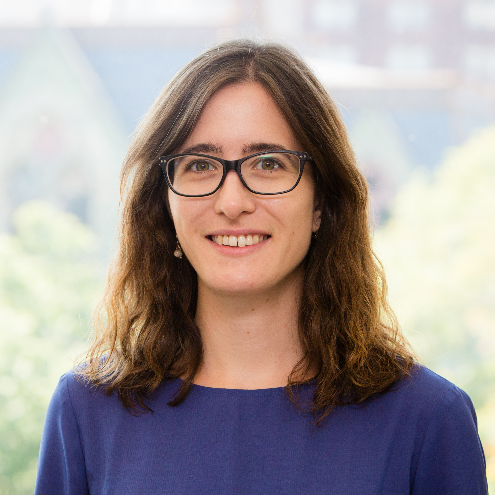

<!-- {: .align-left} -->

<figure>
     
</figure>

I am a postdoctoral researcher in Statistics at the University of Torino, working with [Stefano Favaro](https://sites.carloalberto.org/favaro/). 
I am also a member of the ["de Castro" Statistics Initiative](https://www.carloalberto.org/research/statistics-initiative/) at Collegio Carlo Alberto.  
I received my PhD in Statistics from the University of Pennsylvania under the supervision of [Ed George](https://statistics.wharton.upenn.edu/profile/edgeorge/) and [Shane Jensen](http://stat.wharton.upenn.edu/~stjensen/).

My research interests include Bayesian nonparametrics and hierarchical modeling, clustering, Bayesian regression trees and spatial methods.
